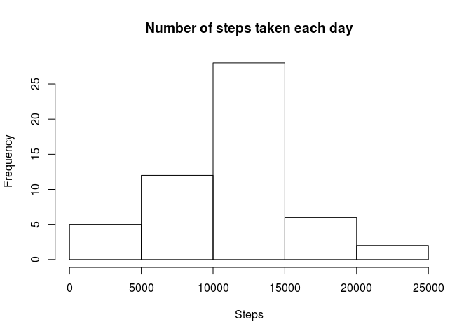
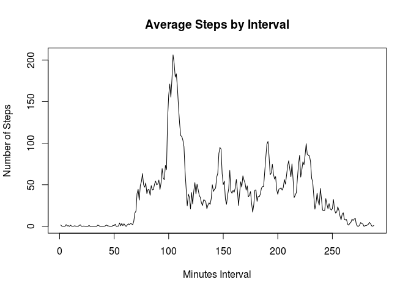
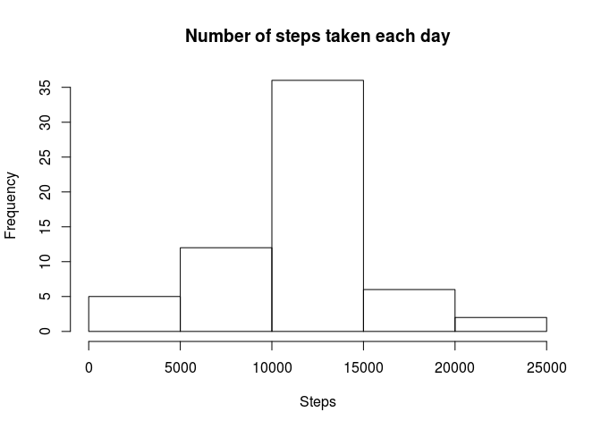
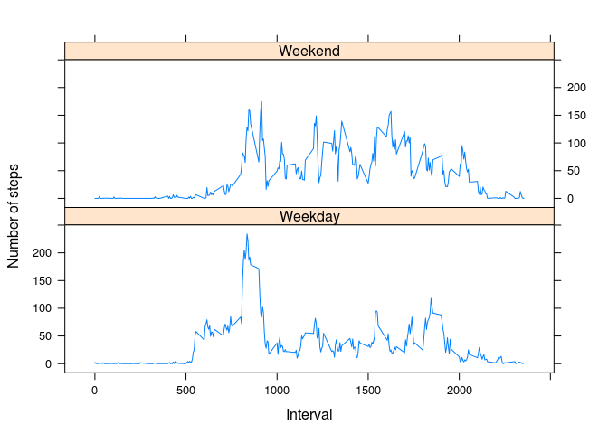

# Reproducible Research: Peer Assessment 1


## Loading and preprocessing the data

Show any code that is needed to

1. Load the data (i.e. read.csv())
2. Process/transform the data (if necessary) into a format suitable for your analysis

```r
setwd('/home/ruben/coursera_ds/RepData_PeerAssessment1')
activity <- read.csv('activity.csv',na.strings="NA")
activity$date <- as.Date(activity$date, format="%Y-%m-%d")
```

## What is mean total number of steps taken per day?

For this part of the assignment, you can ignore the missing values in the dataset.

1. Make a histogram of the total number of steps taken each day
2. Calculate and report the mean and median total number of steps taken per day


```r
steps_by_date <- aggregate(steps ~ date, data = activity, FUN = sum)
hist(steps_by_date$steps, xlab="Steps", main="Number of steps taken each day")
```

 

```r
# Calculate the mean of steps by date
mean(steps_by_date$steps, na.rm=TRUE)
```

```
## [1] 10766.19
```

```r
# Calculate the median of steps by date
median(steps_by_date$steps, na.rm=TRUE)
```

```
## [1] 10765
```

## What is the average daily activity pattern?

1.Make a time series plot (i.e. type = "l") of the 5-minute interval (x-axis) and the average number of steps taken, averaged across all days (y-axis)

2.Which 5-minute interval, on average across all the days in the dataset, contains the maximum number of steps?


```r
steps_by_interval <- aggregate(steps ~ interval, data = activity, FUN = mean)
plot(steps_by_interval$steps,type='l',ylab='Number of Steps',xlab='Minutes Interval', main='Average Steps by Interval')
```

 

```r
# Interval with the maxiumun steps
steps_by_interval$interval[which.max(steps_by_interval$steps)]
```

```
## [1] 835
```

## Imputing missing values
Imputing missing values

Note that there are a number of days/intervals where there are missing values (coded as NA). The presence of missing days may introduce bias into some calculations or summaries of the data.

1.Calculate and report the total number of missing values in the dataset (i.e. the total number of rows with NAs)

2.Devise a strategy for filling in all of the missing values in the dataset. The strategy does not need to be sophisticated. For example, you could use the mean/median for that day, or the mean for that 5-minute interval, etc.

3.Create a new dataset that is equal to the original dataset but with the missing data filled in.

4.Make a histogram of the total number of steps taken each day and Calculate and report the mean and median total number of steps taken per day. Do these values differ from the estimates from the first part of the assignment? What is the impact of imputing missing data on the estimates of the total daily number of steps?


```r
# Number of rows with NA values
sum(is.na(activity))
```

```
## [1] 2304
```

```r
# The strategy used to complete NA values is to fill with the mean of the interval
clean_activity <- activity
for (i in 1:nrow(clean_activity)) {
  if (is.na(clean_activity[i,]$steps)) {
    missed_interval <- clean_activity[i,]$interval
    clean_activity[i,]['steps'] <- steps_by_interval[steps_by_interval$interval == missed_interval,]$steps
  }  
}

steps_by_date_clean <- aggregate(steps ~ date, data = clean_activity, FUN = sum)
hist(steps_by_date_clean$steps, xlab="Steps", main="Number of steps taken each day")
```

 

```r
# Calculate the mean of steps by date
mean(steps_by_date_clean$steps, na.rm=TRUE)
```

```
## [1] 10766.19
```

```r
# Calculate the median of steps by date
median(steps_by_date_clean$steps, na.rm=TRUE)
```

```
## [1] 10766.19
```

## Are there differences in activity patterns between weekdays and weekends?

```r
activity$day <- weekdays(activity$date)

for (i in 1:nrow(activity)) {
  if ((activity[i,]$day == 'Sunday') | (activity[i,]$day == 'Saturday')) {
    activity[i,]$day <- 'Weekend'
  } else {
    activity[i,]$day <- 'Weekday'
  }
}

act <- aggregate(steps ~ interval + day, data = activity, FUN = mean)
xyplot(steps ~ interval | day, 
           data = act,
           type = "l",
           xlab = "Interval",
           ylab = "Number of steps",
           layout=c(1,2))
```

 


